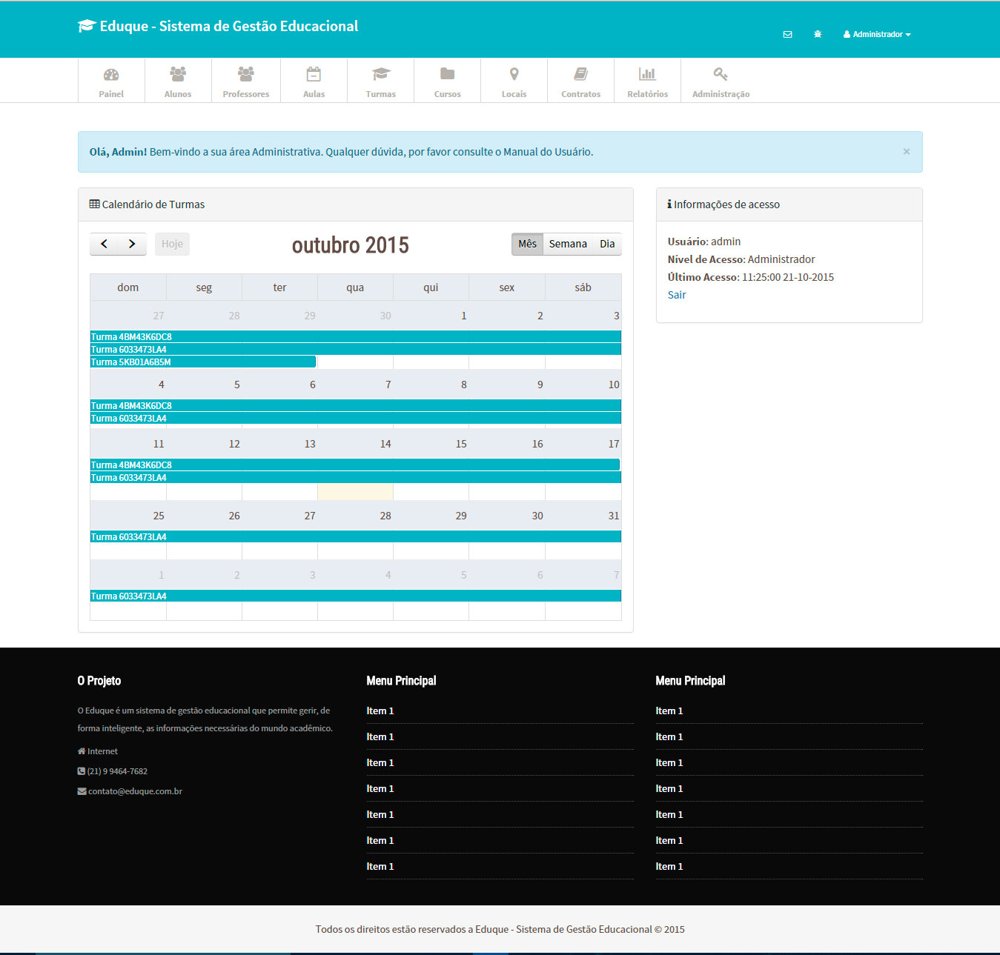

# Eduque - Sistema de Gestão Educacional
O Eduque foi o meu Trabalho de Conclusão de Curso em 2015, vulgo TCC, para concluir minha passagem pela Universidade Estácio de Sá, no curso de Sistemas de Informação. Ele é um Sistema de Gestão Educacional, com foco em gerir uma Instituição de Ensino Privada, independente ou coletiva. O sistema oferece todo suporte necessário para efetuar uma gestão de excelência, com foco em resultados mais expressivos para o seu negócio e integração financeira com o Gateway de Pagamentos do PagSeguro.

Este projeto foi dividido em duas etapas: a documentação e a codificação. A documentação, que contém cerca de 198 páginas, foi escrita em quatro meses, começando em julho e terminado em novembro. Já a codificação foi mais rápido, começando em julho e sendo concluída em setembro, no máximo.
          
O Eduque foi construído usando o paradigma de Padrões de Projetos MVC, com o Framework PHP conhecido como CodeIgniter, ou CI, na sua última versão, e Web Design Responsive, preparada para ser acessada por dispositivos móveis sem que perca Experiência do Usuário. A Arquitetura de Informação dele foi construída com bases nos wireframes do software Balsamiq Mockups, o que, de certa forma, agilizou e muito a definição dos elementos textuais da interface.

As tecnologias utilizadas para o desenvolvimento do projeto foram: PHP 5.4, MySQL, HTML5, CSS3, Javascript, jQuery e Bootstrap.

No final, o TCC ficou com NOTA *9*.




### Requisitos Mínimos
1. PHP 5.4 > (ou alguma versão que suporte CodeIgniter 2.x)
2. MySQL 3.0 >
3. Apache ou Nginx

## Instalação
Dentro da pasta *database* tem um script sql chamado Eduque.sql. Ele contém todas as tabelas, registros e relacionamentos responsáveis pelo banco de dados do projeto. Portanto, é necessário criar um banco de dados com nome `foo` ou alterar o script e importar as tabelas para o banco de dados criado por você.

Selecione todos os arquivos e mova para seu servidor e faça as alterações necessárias para o projeto em *application/config.php*.

## Integração com PagSeguro
O Eduque tem integração com o PagSeguro, Gateway de Pagamento bastante utilizado no Brasil inteiro. 
Crie sua conta no PagSeguro e peguei os dados de acesso à API. (Token e E-mail da conta), altere as variáveis dentro do arquivo de configuração em *application/libraries/pagsegurolibrary/config/PagSeguroConfig.php*:
```php
$PagSeguroConfig['credentials']['email'] = "seuemail@email.com";
$PagSeguroConfig['credentials']['token'] = "SEUTOKENAQUI";
```


## Estrutura do Projeto (em andamento...)

* - Controllers
    * Admin
    * Aluno
    * Aula
    * Contrato
    * Curso
    * Local
    * Pagamento (Integração com pagseguro)
    * Professor
    * Relatório
    * Turma
    * TurmaAluno
    * TurmaCurso
    * Usuario

* - Models
    * Aluno_model
    * Aula_model
    * Contrato_model
    * Curso_model
    * Local_model
    * Professor_model
    * ProfessorCurso_model
    * Relatorio_model
    * Turma_model
    * TurmaAluno_model
    * TurmaCurso_model
    * Usuario_model

## Manual do Usuário
O manual encontra-se no documento *TCC - PROJETO FINAL - EDUQUE.docx* dentro da pasta *doc*.

## Release History
* 0.0.1
    * RELEASE: Publicação do código como open-source e disponibilizado via github.

## Licença
O código é open-source e você pode usar da forma que bem entender.